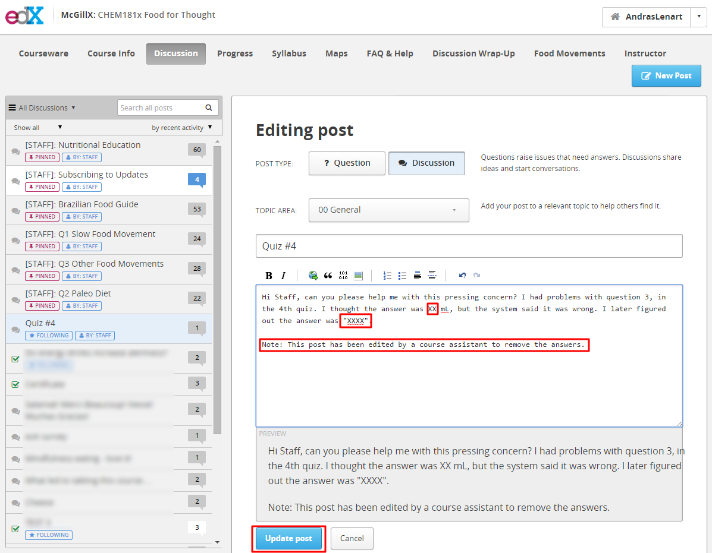

## Common Issues and Resolutions

### Common Discussion Forum Issues

Students will typically have several issues with regards to the discussion forum:

#### Students Unable to Upload Images

They may have problems uploading images to their posts. This is commonly because the image size is limited, and they do not know how to compress the image. In this case, you might ask them to find an image elsewhere on the internet and share the link, or simply to describe the image. 

#### Students Posting Answers in Discussion Posts

Students may post answers to problem questions in the forum. We encourage students to ask for clarification and ensure their understanding but we ask that students avoid posting the answers to problems. Should students create a post containing answers replace their answers with "XXXX". Add an explanation for the edit at the bottom of the post. 

Note: Posting and discussing ungraded problems answers is fine, but posting answers to graded problems before the deadline has passed is not.

#### Students Categorizing Discussion Posts as Discussions or Questions

Students who are new to edX may categorize their posts incorrectly. Remind the students that for their future posts, they have the option of classifying the post as either **discussion** or **question**. If their post was incorrectly categorized as a question, mark your response as the answer. Additionally, you can edit their post and change the categorization manually.

### UTC Time Zone Due Dates

Students will frequently be confused by the due dates, not realizing that the deadlines are stated in the UTC/GMT time zone. You can suggest they visit use a website such as [timeanddate](http://www.timeanddate.com/worldclock/converter.html) to convert UTC time to their local time.

We try to avoid issues of confusion by setting soft deadlines, meaning the deadline that appears to students is often many hours in advance of the actual deadline.

### Problems with Drag and Drop

Students may complain about not being able to complete the drag-and-drop questions on their tablets or phones. Notify them this is a limitation of the edX platform which McGillX has no control over. edX is working towards creating mobile friendly interactions for the future. Advise them to answer the questions on another device.

### Browser Related Issues

Many technical issues students report can be resolved by using an alternative browser. Ask them which browser and on what device the issue arouse. We advise against using Internet Explorer; suggest Chrome or Firefox as an alternative. Chrome often has the fewest issues.

Issues can result if they have disabled javascript; advise them to enable JavaScript when using the edX platform. For directions on enabling javascript in chrome see [https://support.google.com/adsense/answer/12654?hl=en](https://support.google.com/adsense/answer/12654?hl=en)

### Student Progress Page

The **Progress Page** is accessible from the main header. This is where students can check their own course progress.

To check a specific students progress, click the **Instructor** tab, then the **STUDENT ADMIN** sub-tab. Insert the student's email address or username into the box, and click the "**Student Progress Page**" hyperlink.

### Problem Submission History

To look at a student's responses to a specific question:

1. Find the question location in the courseware. (Students will typically complain about specific questions located on a single page.) 
2. Click "**SUBMISSION HISTORY**" and enter the student's username. You can now scroll through all of the students submissions, and see the location of the question. At times it might be hard to find the answer in the code (which is written in JSON), so keep in mind what the answer should look like. 

### Reset Problem Attempts

To reset a student's submissions, find the question in the courseware and click "**STAFF DEBUG INFO**". Enter the student's username, and click "**Reset Student Attempts**".

