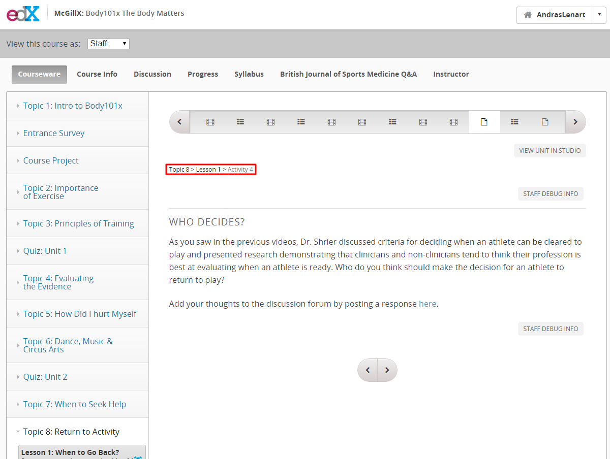
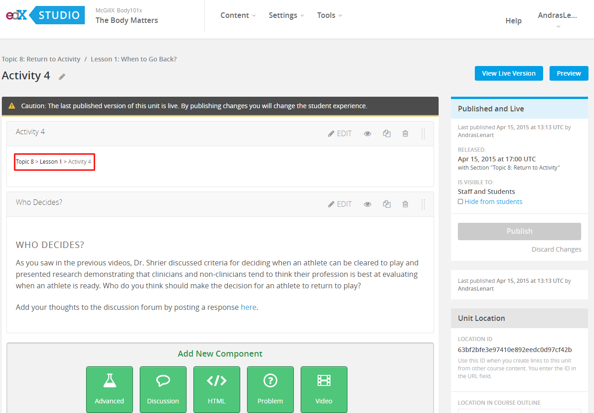
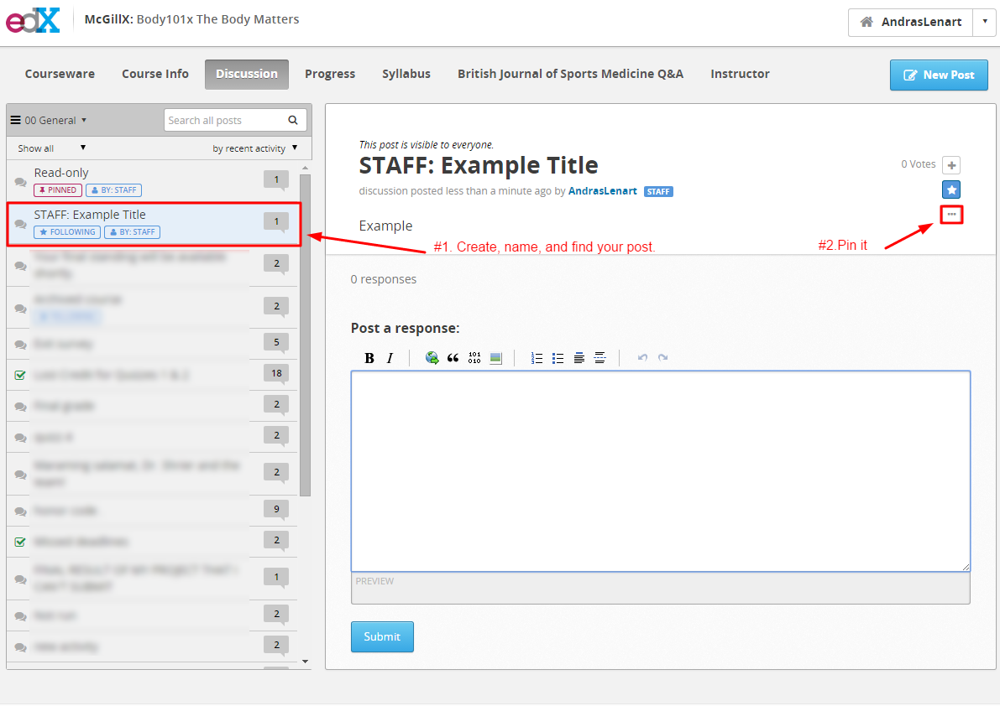
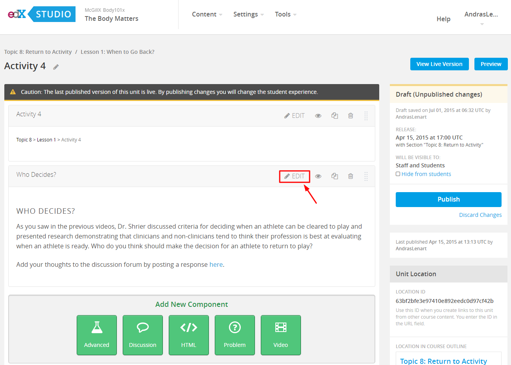
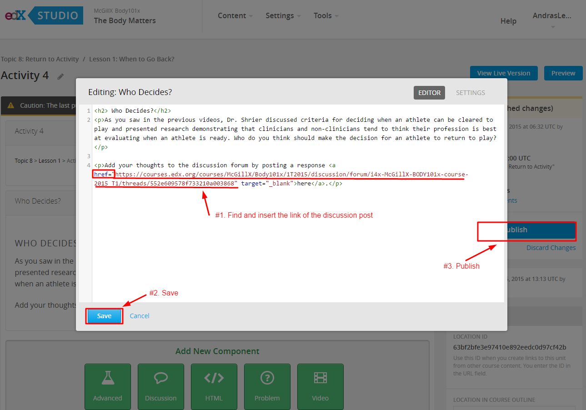
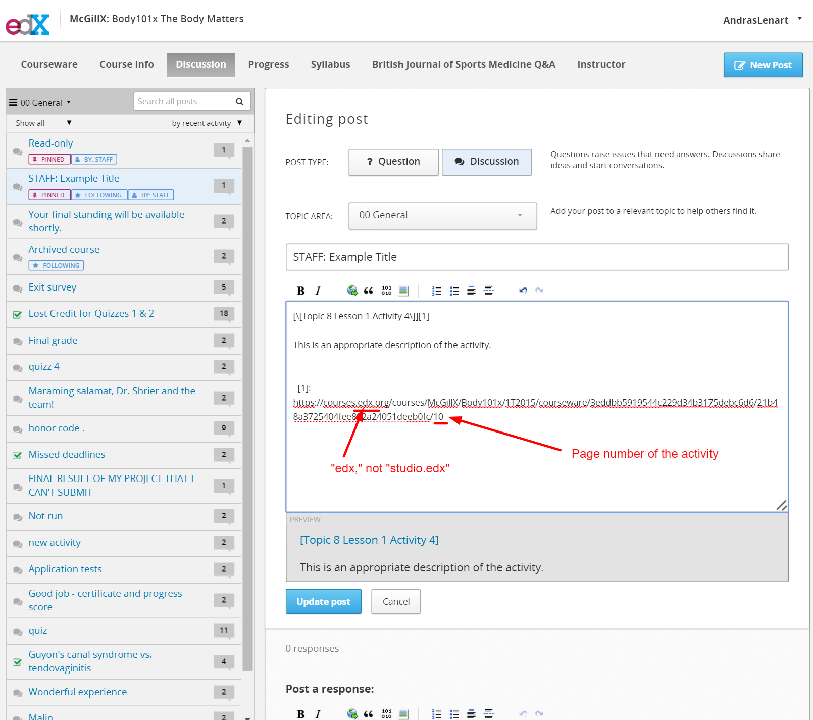

## Creating Course Discussion Threads

Course Discussion Threads need to be intergrated with the course material, with links going to and from the post to the related course material.  

##### Open the studio and course page related to the activity

##### On the Course Page:

Here you will create a create a thread on the discussion forum.

1. Click the upper navbar “Discussion” tab
2. Create a “New Post” [COURSE CODE]:...
3. Find the post you just created
4. Pin the post to the top of the discussion
5. Open the post
6. Right click the post and copy the URL for the discussion thread

##### On the Studio Page:

1. Click edit on the component which contains the “here” hyperlink
2. In the window that opens edit the html
3. Find the href=””
4. href = “Paste Url for Discussion Post Here”
5. Click save
6. Click Publish
7. Test that the hyperlink on the studio page takes you to the discussion post.

inset image staff threads 

##### Complete the discussion post

1. Go back to the discussion post
2. Hyperlink the title to the activity in the courseware (the normal courseware, not the studio version) 
3. Finish the discussion post by adding a description and ensuring the URL has a number corresponding to the page number after the slash.

