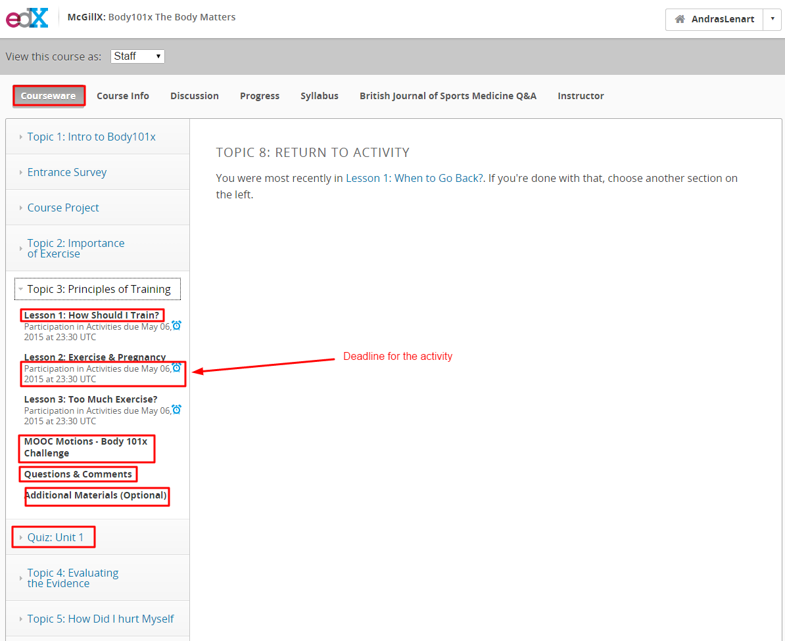
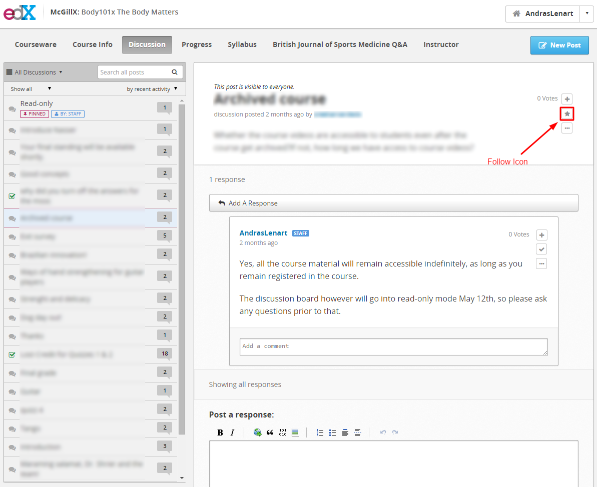
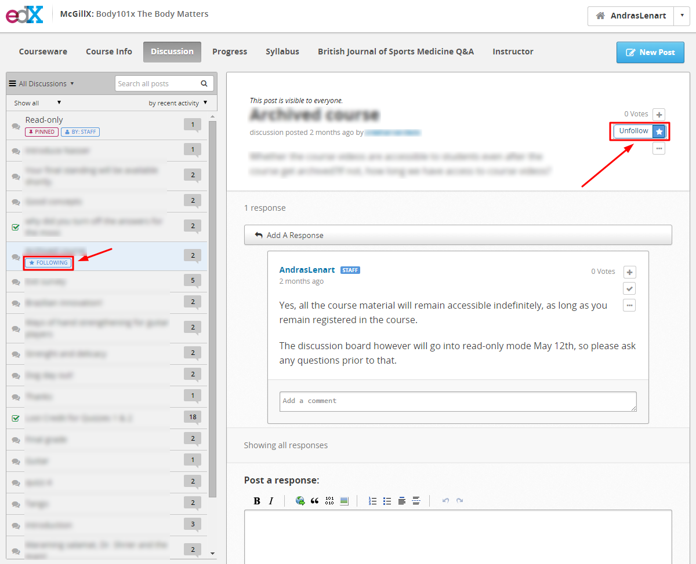
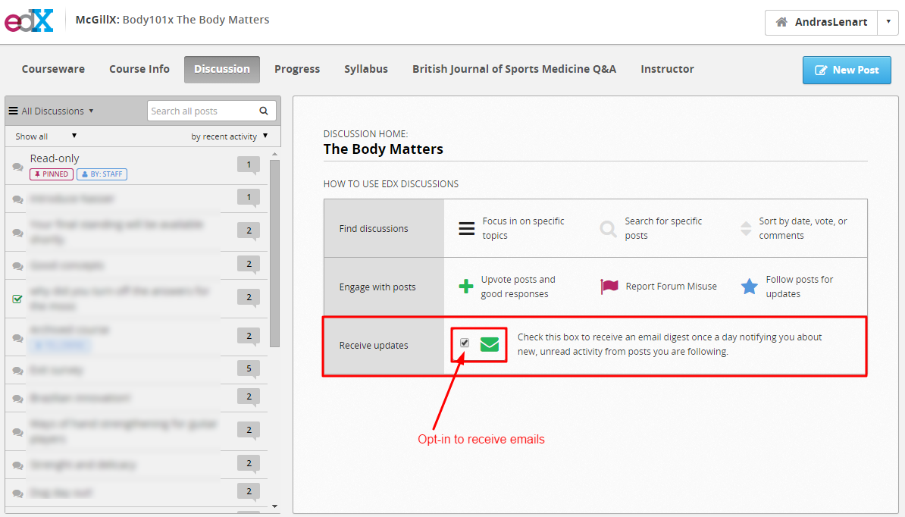
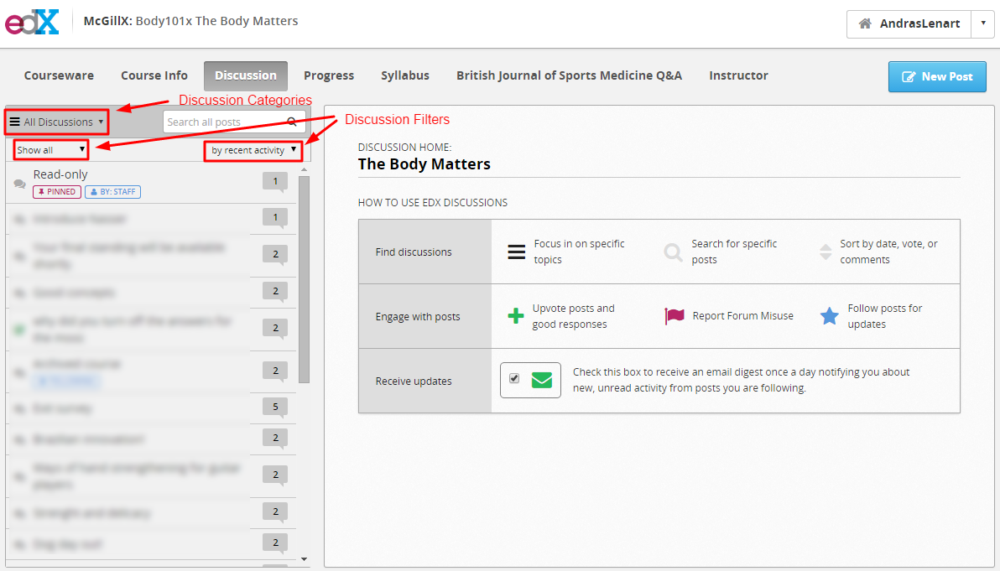

## Discussion Monitoring

### General Advice

- Do your best to respond to students in a timely fashion. For issues that may take further investigation, inform students that you are looking into the issues and will get back to them shortly.

- When posting or responding in the discussion board try to support your claims and arguments with citations. If you are stating your opinion, make sure to mention that in your comment. 

- Students starting the course late will be discussing topics already covered by the majority of the class. It may be helpful to refer these newer students to specific forum posts in which those topics were covered.

- Students will post responses to staff initiated discussion questions in individual posts instead of the designated staff threads. If you respond to these, advise them to respond to the appropriate thread in the future. 

- Some students will not check the syllabus and complain once they miss a deadline. Generally, these deadlines are not changed based on individual requests.

- Student participation in the forum will drop off substantially as the course continues. 

- In the first few weeks of the course, expect a lot of student introductions. You do not need to respond or read all of these.

- Students often forget to reference the location of the issue within the course. Politely ask them refer to the speIn the first few weeks of the course, expect a lot of student introductions. You do not need to respond or read all of these.cific week/topic #, video #, question #, and time mark in the video so that you may better assist them.

- After you answer a student's question, try to stimulate further discussion. For example, you could ask a follow up question or ask other students to chime in.

- When posting or responding in the discussion board try to support your claims and arguments with citations. If you are stating your opinion, make sure to mention that in your comment.

- If a student makes outlandish claims, it may be easiest to address the topic by asking where they have heard that idea. This can lead to a discussion about the veracity and reputation of sources.

___

###  Following Discussion Threads

After responding to a student post, **follow** the post by pressing the star icon. This will notify you if a student asks a follow up question, or response on that post at a later date. 

Once you **follow** a post, the star icon will be blue, and an emblem will be visible in the side bar. 

___

###  Subscribing to email digests

To receive notifications of new responses in the daily digest email, make sure you have signed up for it. This page is displayed when you click the discussion tab in the header.

___
### Discussion Filtering

To filter discussions by category or by type, click on the appropriate icon.

___

