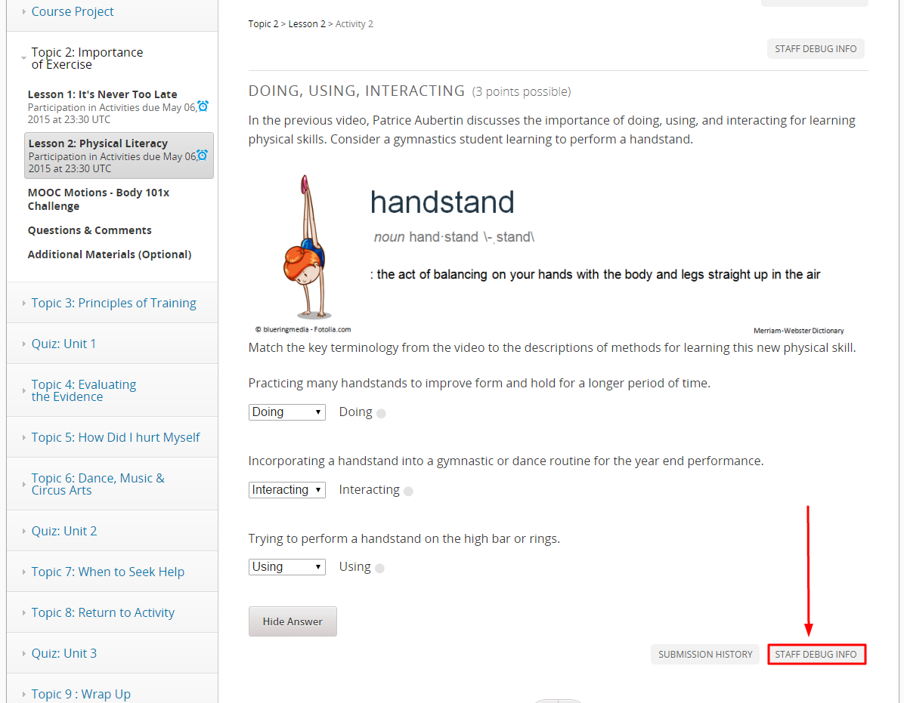
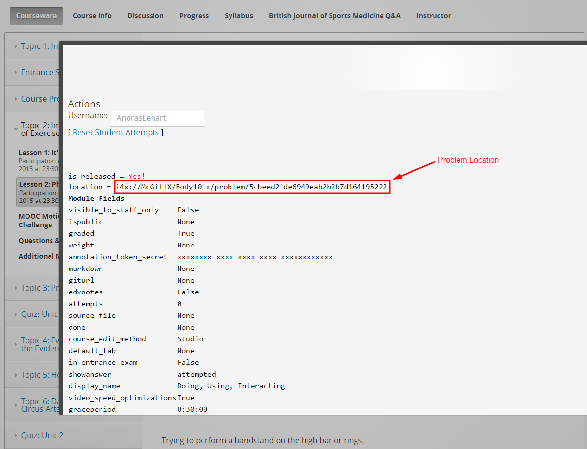
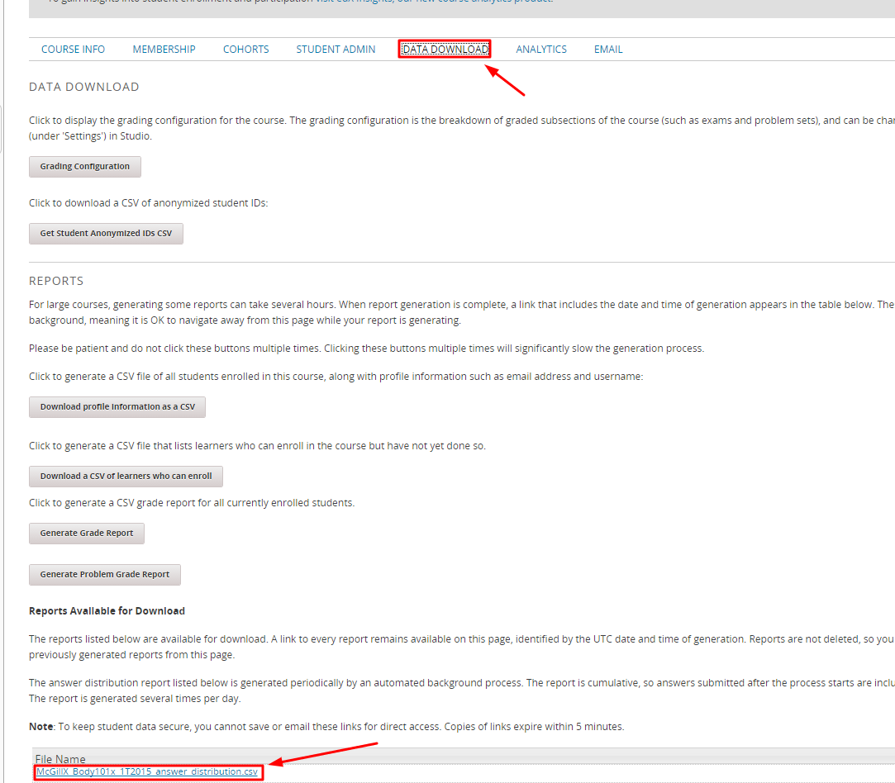
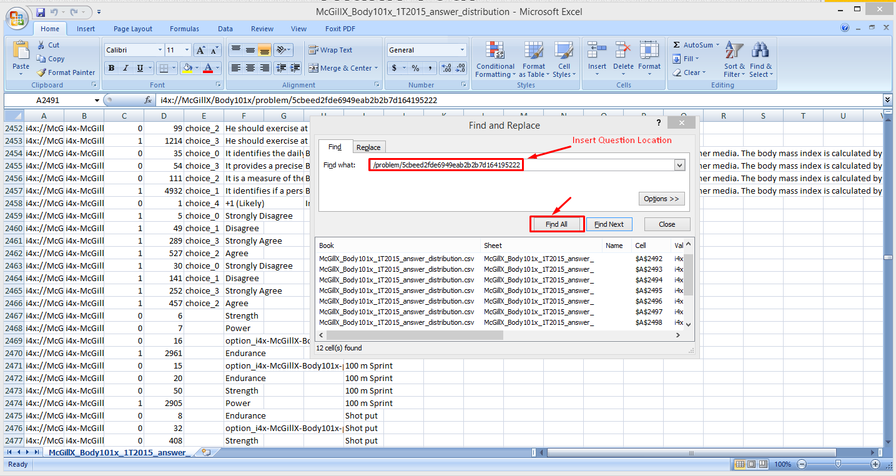

## Download Class Results to a Problem

1. Find the problem location in the courseware. 
2. Click **STAFF DEBUG INFO**, and note the location. 
3. Then go to the **Instructor** tab, click **DATA DOWNLOAD**, and click **answer_distribution.csv**. 
4. Open this downloaded file, and use the search function to find the problem location you found in the **STAFF DEBUG INFO**.

