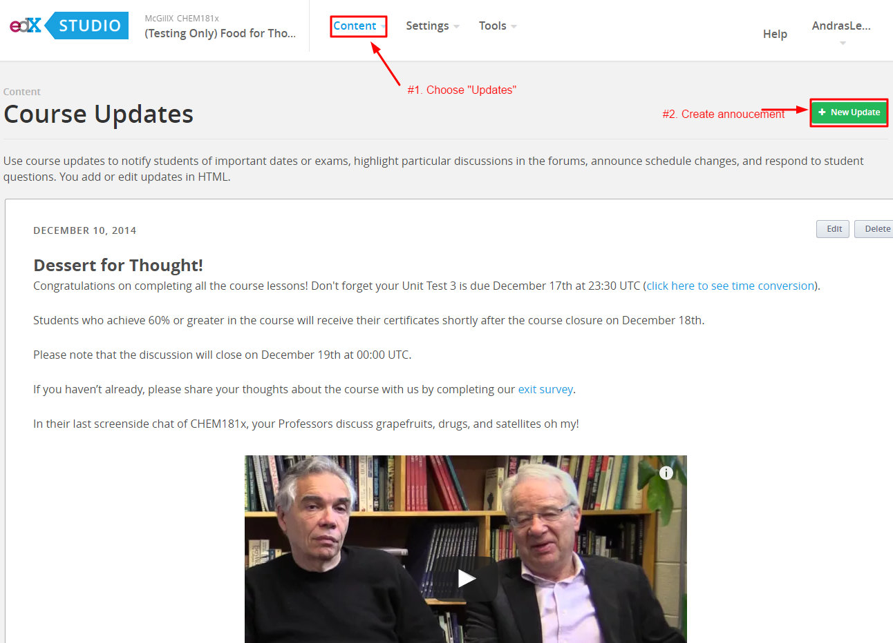
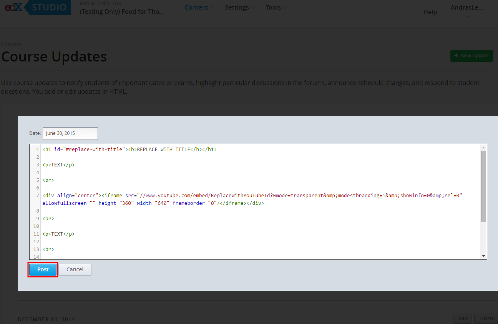
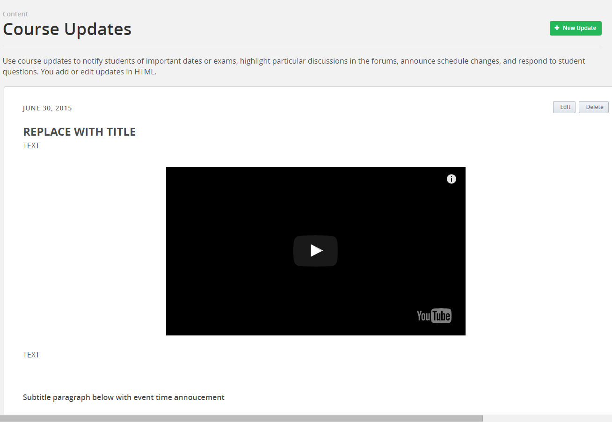

Creating Course Annoucements
============================

For course annoucements, first create the post in **studio.edge.edx.org**. This way the post can be previewed in the edx environment, and leave the course unaffected. Once you are statisfied with the announcement, copy the post to the **studio.edx.org** course. 

1. Draft the announcement in **studio.edge.edx.org**

Select “**Updates**” from the “**Content**” tab. Select "New Update."

Copy and paste the template below into the html editor:

.. code-block:: html

    <h1 id="#replace-with-title"><b>REPLACE WITH TITLE</b></h1>
    
TEXT

     
    
<iframe src="//www.youtube.com/embed/ReplaceWithYouTubeId?wmode=transparent&amp;modestbranding=1&amp;showinfo=0&amp;rel=0" allowfullscreen="" height="360" width="640" frameborder="0"></iframe>

     
    
TEXT

     
    <h3>Subtitle paragraph below with event time annoucement</h3>
     
    
Your first assignment which is due on Friday, February 13 at 23:30 UTC (click<a href="http://www.timeanddate.com/worldclock/fixedtime.html?msg=Homework%3A+Assignment+%231&iso=20150213T1130&p1=1440" target="_blank"> here </a>to see time conversion).

    

2. Post and preview the announcement in the live edge course

3. Go through the same process in the  **studio.edx.org** course, using the same HTML code for the announcement. 

Note, when you create a new update there is no preview mode (it will be
posted to the course space and be visible to student’s as soon as you
save)

4. (Optional) Post the URL to the discussion updates thread. (This is
applicable only if students have been asked to follow a specific thread
for updates.) Respond to the thread with a link to the update.
 
 Thread Contents
 
.. code-block:: html

    [Update: Title for Update][1]
      [1]: https://courses.edx.org/courses/McGillX/ATOC185x_2/1T2015/info#title-of-update

.. important:: If you upload images or other files to the course do not include spaces or special characters (!, &, ?) in the file name. Use underscores, hyphens, letters and numbers only.
