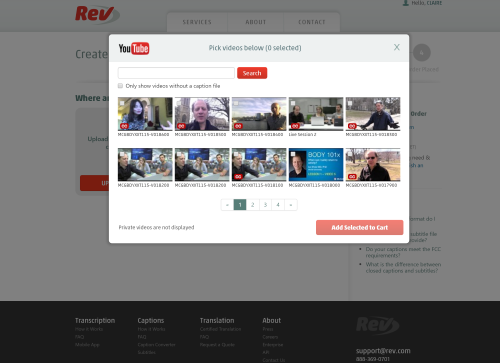
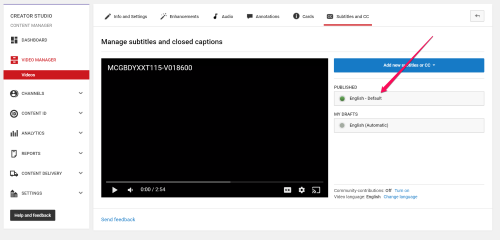

Transcription
=============================

Overview
---------------------------------------------------

Transcriptions are generated for most course videos and are displayed alongside the video on the edX platform. Transcription allows students to quickly view and search videos for specific content. It also facilitates access for learners with certain impairments. 
McGillX uses a transcription service called `rev <https://www.rev.com//>`_; once transcripts are completed by rev, transcriptions need to be manually updated to the course specifications and checked to ensure accuracy. This section describes the transcription process.

Uploading Transcripts to Rev
---------------------------------------------------

1. Direct your browser to `rev <https://www.rev.com//>`_
2. Log in using the account associated with the course which has videos requiring transcription
3. Under `Order History <https://www.rev.com/account/orderhistory>`_ click "Place New Order" in the top right
4. Select "Captions" from the dropdown
5. Choose "FROM YOUTUBE" as the option
6. Select the account for the associated course
7. Click "Allow" on the permissions window that appears
8. Select the video or videos and click "Add Selected to Cart"

.. note:: videos that display a "CC" in the lower left corner of the thumbnail have transcripts associated with them already.

Reviewing Transcripts from Rev
---------------------------------------------------

Rev returns transcripts to the associated Youtube video automatically. You can use the Youtube transcript editor to review and edit the transcripts.

1. Go to the `McGillX Youtube Content Manager Dashboard <https://www.youtube.com/dashboard?o=BGlye001lwz6jaZIjyqHzg>`_
2. Select Video Manager from the left hand panel
3. Find the video in need of review and editing
4. Select "Subtitles and CC" from the dropdown carrot next to "Edit"
5. Click the set of substitles labelled as "English - Default" to begin editing

6. Publish the edits once you have finished

